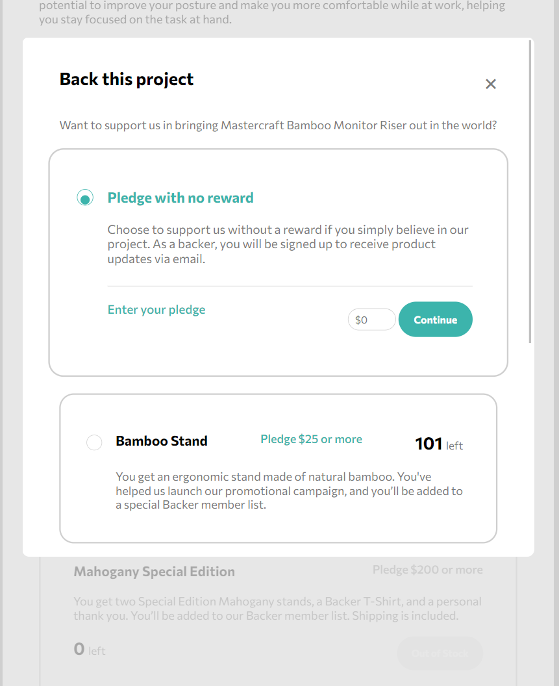

# Frontend Mentor - Crowdfunding Product Page

Thanks for checking out this front-end coding solution. This is a solution to the [Crowdfunding product page challenge on Frontend Mentor](https://www.frontendmentor.io/challenges/crowdfunding-product-page-7uvcZe7ZR).

## Table of contents
  - [The challenge](#the-challenge)
  - [Screenshot](#screenshot)
  - [Links](#links)
  - [Built with](#built-with)
  - [Author](#author)

## The Challenge

### Users Should Be Able To:

- View the optimal layout of the app based on their device's screen size.
- See hover states for all interactive elements throughout the page.

### Modal States and Usage:

- **Displaying Modals:** Users will encounter modal windows triggered by specific elements or particular scenarios within the project. For instance, upon interacting with donation options or receiving special thank-you messages.
  
- **User Feedback:** Modal windows aim to provide users with contextual information about their actions, enhancing the overall user experience. For instance, displaying a thank-you message upon successfully completing a donation.
  
- **User-Friendly Interface:** Modal windows are designed to guide users through specific actions in a user-friendly manner, ensuring a smooth flow within the project.

### Screenshot

### Links

- Solution URL: [Here](https://www.frontendmentor.io/solutions/crowdfundingproductpagefrontendmentor-bSe7x83wab)
- Live Site URL: [Here](https://ozlemxates.github.io/Crowdfunding-Product-Page-FrontendMentor/)

### Built with

- Semantic HTML5 markup
- CSS custom properties
- Flexbox
- Vanilla JavaScript

## Author

- GitHub Profile => [Here](https://github.com/ozlemxates)